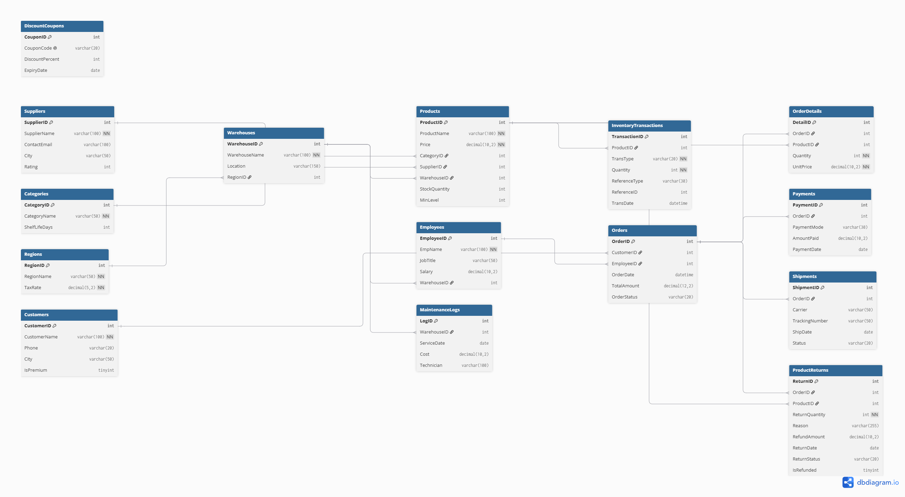
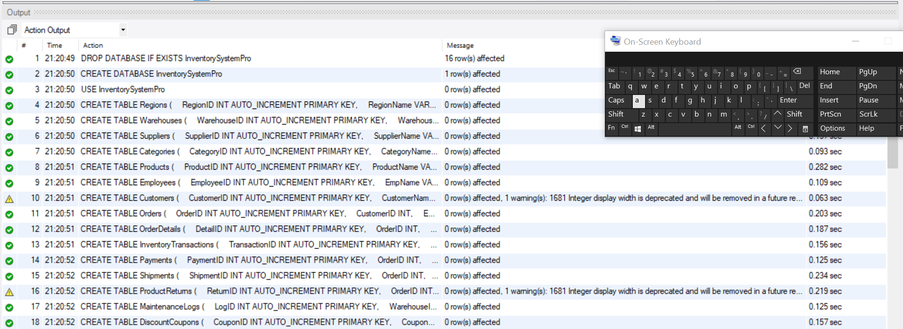
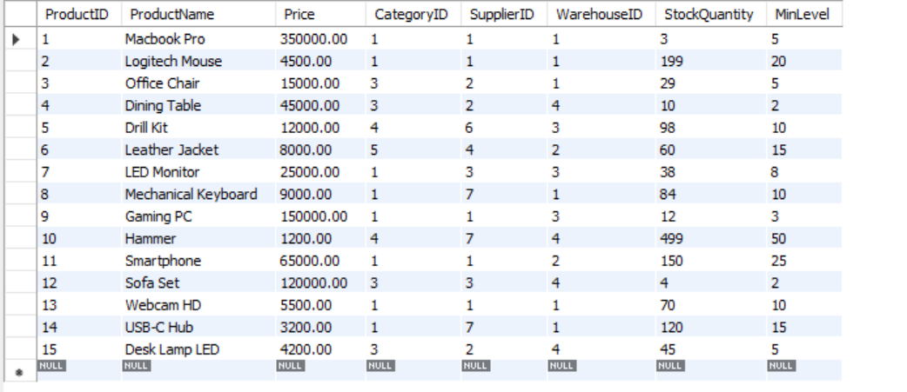
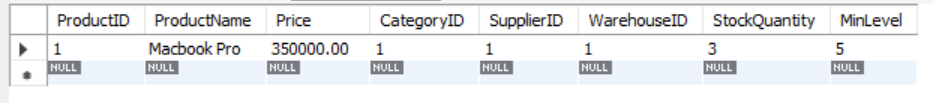
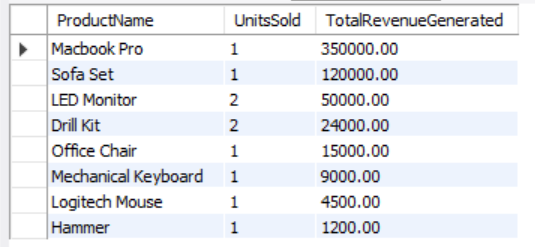

# Inventory, Supplier & Sales Management System (ISMS)


## 📖 Objective
A complete **relational database system** for managing inventory, suppliers, warehouses, employees, customers, orders, payments, shipments, and returns. Demonstrates **database design, integrity constraints, triggers, views, CTEs, window functions, and analytical reporting** using MySQL.

## 🛠️ Tech Stack
- **Database:** MySQL 8.0+
- **SQL Features:** DDL, DML, Triggers, Views, CTEs, Window Functions
- **Tools:** MySQL Workbench / Command Line

## ✨ Features
- **15 Normalized Tables:** Built with foreign keys, `CHECK` constraints, `ENUM` types, and optimized indexes.
- **Automated Triggers:** Handles dynamic stock deduction, order total updates, and stock adjustments.
- **Reporting Views:** Pre-configured master inventory views for quick analytical queries.
- **15 Analytical Queries:**
  - Regional valuation & tax rates
  - Warehouse stock valuation
  - Supplier performance & ratings
  - Category rankings using `RANK()`
  - Low-stock reorder alerts
  - Employee sales performance
  - Premium customer lifetime value using Common Table Expressions (CTEs)
  - Payment audit & outstanding balance
  - Top-selling products
  - Inventory transaction log
  - Payment mode summary
  - Shipment status breakdown
  - Return & refund audit
  - Monthly revenue trend using `LAG()`

## 🧠 SQL Concepts Used
| Concept | Purpose |
|---------|---------|
| **Normalization (3NF)** | Avoid redundancy and ensure strict data integrity |
| **Foreign Keys** | Enforce referential integrity across all 15 tables |
| **CHECK Constraints** | Validate data ranges (e.g., stock levels, pricing thresholds, status codes) |
| **ENUM** | Restrict transaction types and categorical states |
| **Indexes** | Optimize query performance on frequently joined foreign keys |
| **Triggers** | Automate stock updates and real-time total recalculations |
| **Views** | Simplify complex analytical queries into reusable virtual tables |
| **CTEs** | Multi-step reporting pipelines for customer LTV and revenue tracking |
| **Window Functions** | `RANK()` and `LAG()` for comparative and trend analytics |

## 🖼️ Screenshots
| ER Diagram | Tables Created | Products Data | Low Stock | Top Selling |
|------------|----------------|---------------|-----------|-------------|
|  |  |  |  |  |

## ⚙️ How to Run
1. Install **MySQL Server 8.0+**.
2. Clone the repository and open your terminal or MySQL Workbench:
   ```bash
   git clone [https://github.com/Maheen2307/ISMS.git](https://github.com/Maheen2307/ISMS.git)
   cd ISMS
   ```
3. Run the script:
   ```bash
   mysql -u root -p < ISMS.sql
   ```
4. The script creates the database, tables, sample data, and executes all 15 reports.

## 📁 Repository Structure
```plaintext
ISMS/
├── screenshots/
│   ├── erd.png
│   ├── tables_created.png
│   ├── products_data.png
│   ├── low_stock.png
│   └── top_selling.png
├── ISMS.sql
├── LICENSE
└── README.md
```

## 📋 Sample Output (Report #6 – Low-Stock Alert)
```plaintext
+---------------------+----------------+---------------+----------+-----------------------+
| ProductName         | WarehouseName  | StockQuantity | MinLevel | UnitsNeededToReorder  |
+---------------------+----------------+---------------+----------+-----------------------+
| Macbook Pro         | LHR-Main       |             3 |        5 |                     2 |
| Sofa Set            | MTN-Storage    |             5 |        2 |                    -3 |
+---------------------+----------------+---------------+----------+-----------------------+
```

## ⚠️ Limitations
- **Stored Procedures:** Lacks dedicated stored procedures for complex multi-table operational logic (e.g., executing checkout flows).
- **Update Triggers:** Trigger logic for updates on `OrderDetails` updates stock levels but lacks pre-update stock validation checks.
- **Role Management:** No custom user roles or granular privileges configured at the database level.
- **Environment Scope:** Tailored for academic, portfolio, and analytical demonstration purposes rather than multi-tenant production scale.

## 🚀 Future Improvements
- Implement stored procedures and functions to encapsulate core business transactions.
- Build a web-based dashboard UI (Node.js/Express or Python/Streamlit) for real-time visualization.
- Expand triggers to handle inventory reversals for returns and order cancellations automatically.
- Introduce database role-based access control (RBAC) policies.

## 📄 License
This project is licensed under the MIT License.
